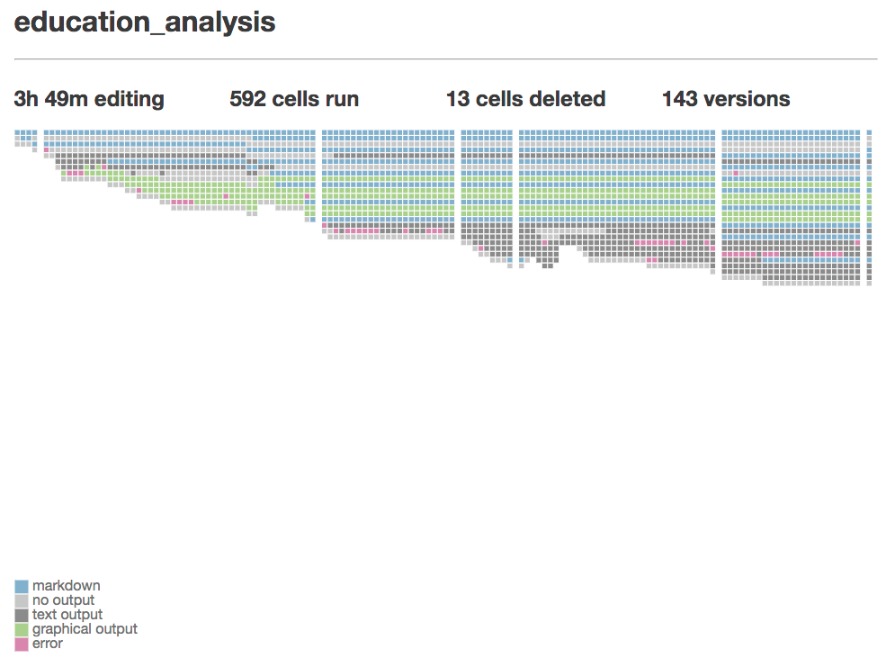

# Comet (Notebook Extension)
Comet is a Jupyter Notebook extension that tracks changes to the notebook over time. It works in tandem with the [Comet server extension](https://github.com/activityhistory/comet_server). You must have both the server and notebook extension installed for the tracking to work properly since the notebook extension listens for events and sends information to the server extension for processing.

  

## What Comet Tracks
Comet tracks how your notebook changes over time. It does so by:
1. tracking the occurrence of actions such as creating, deleting, moving, or executing cells
2. tracking how your notebook changes as a result of these actions

Comet tracks this information in three ways:
1. committing every notebook change to a local git repository
2. periodically saving a full version of the notebook
3. saving the name and time of every action to an sqlite database

Comet is a research tool designed to help scientists in human-computer interaction better understand how people use Jupyter Notebooks. It is primarily a recording tool with limited support for visualizing or reviewing the recorded data.

## Installation
The Comet notebook extension may be installed by downloading this repo, opening a terminal, navigating to the folder containing the downloaded repo, and then installing and enabling the extension using the following commands:

```
jupyter nbextension install comet
jupyter nbextension enable comet/main
```

By default, Comet with store its data in the `.jupyter` folder under your home directory; for example `Users/username/.jupyter` for mac users. We suggest you can change this parameter by editing the `notebook.json` configuration file in the `.jupyter/nbconfig` folder to include a line specifying your data directory. For example: `"Comet": {"data_directory": "/full/path/" }`.

See the [Comet Server repo](https://github.com/activityhistory/comet_server) for instructions on how to install the server extension.
